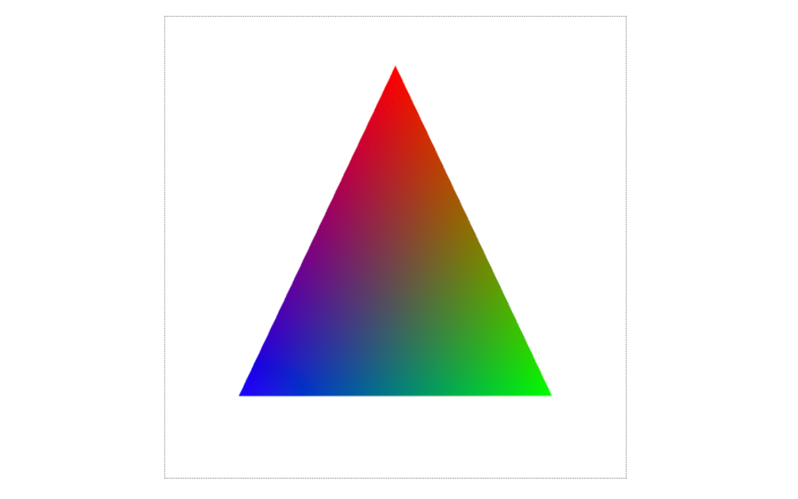

# ts-webgl

ts-webgl is a project template dedicated for learning [WebGL](https://www.khronos.org/webgl/). It is built using the
following technology stack:

- [TypeScript](https://www.typescriptlang.org/)
- [vite](https://vitejs.dev/)
- [Prettier](https://prettier.io/)
- [ESLint](https://eslint.org/)

For learning WebGL, I have been utilizing the following resource:

- [WebGL 開発支援サイト wgld.org](https://wgld.org/)

The logic concerning WebGL and the matrix operation library unique to this
site, '[minMatrix.js](https://wgld.org/j/minMatrix.js)', have been encapsulated into TypeScript classes.

While I am proficient in writing code in JavaScript, Go, Python, and C++, I have only just commenced learning about
WebGL and TypeScript. Consequently, I am not in a position to judge whether the code written is optimal. However, as I
continue to learn, the code in ts-webgl will be refined and improved.

# How to use

Node.js is required.

```sh
git clone [path to this repository] [directory name of your choice]
cd [directory name of your choice]
npm i
npm run dev
```

When accessed through a browser, a triangle similar to the following will be displayed.



The source files we should write are under the 'project' directory.
